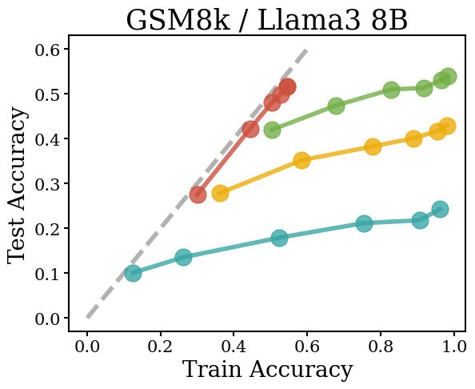
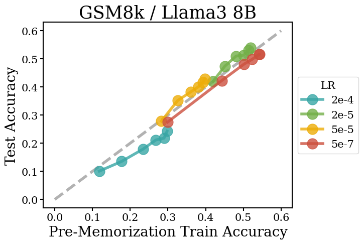

# Reasoning Generalization

Code for reproducing the experiments in [What Do Learning Dynamics Reveal About Generalization in LLM Reasoning?](http://katiekang.com/pdfs/reasoning_generalization.pdf). 

<p align="center">   </p> 

## Setup

```bash
conda create -n reasoning_generalization python=3.9
conda activate reasoning_generalization
cd reasoning_generalization
pip install -r requirements.txt
```

Fill huggingface token in `huggingface_params.py`.

## Usage

See `gsm8k_run.sh` or `math_run.sh` for examples of training and evaluation scripts. 
See `gsm8k_analyze.ipynb` or `gsm8k_analyze.ipynb` for analysis code.

## Acknowledgements

Our codebase borrows code from [stanford_alpaca](https://github.com/tatsu-lab/stanford_alpaca). 